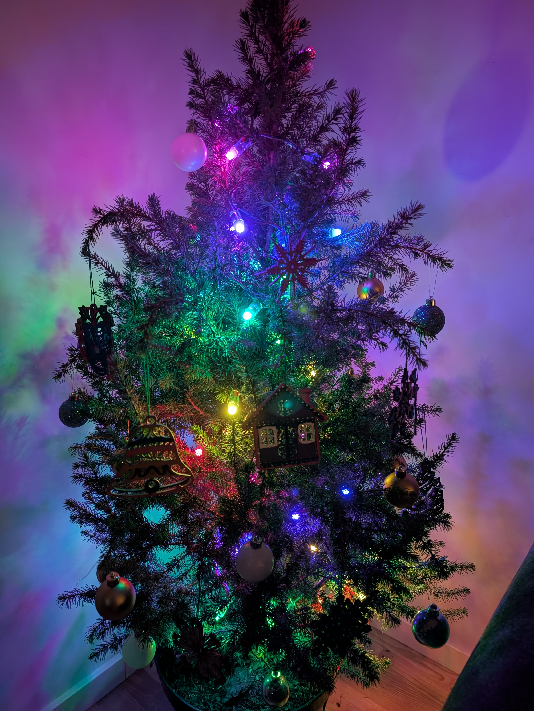
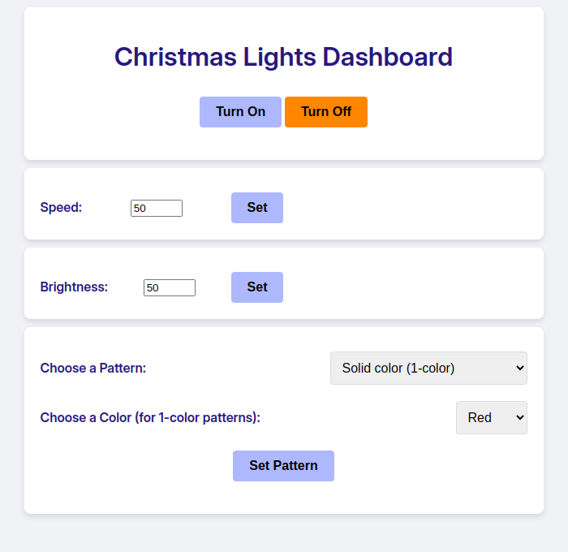

# Christmas-Tree-Lights
Automation code for my Christmas tree 🎄

- [Christmas-Tree-Lights](#christmas-tree-lights)
  - [Initial deployment](#initial-deployment)
  - [Persistence after restarts with `systemd`](#persistence-after-restarts-with-systemd)
  - [Architecture and UI](#architecture-and-ui)
  - [Arduino code (`.ino`) updates](#arduino-code-ino-updates)
    - [First-time setup](#first-time-setup)
    - [Upload script from RaspberryPi to Arduino](#upload-script-from-raspberrypi-to-arduino)
    - [Simple automation for deploying code changes](#simple-automation-for-deploying-code-changes)
  - [Next steps (potentially for 2025)](#next-steps-potentially-for-2025)
    - [High priority](#high-priority)
    - [Low priority](#low-priority)
  - [Final notes](#final-notes)
  - [Hardware](#hardware)

## Initial deployment
- Get the IP of the Pi on the network `arp-scan --interface=wlan0 --localnet`
- SSH into the Pi `ssh USERNAME@IP_ADDRESS`
- `cd` into the project directory and activate the virtual environment `source venv/bin/activate`
- Install requirements `pip install -r requirements.txt`
- Run the server `python3 main.py`
- Access the server using the Pi's IP (on port `5000`) from any device on the network and light up your home!

## Persistence after restarts with `systemd`
- Create the systemd service file `sudo vim /etc/systemd/system/holiday-lights.service` (my content can be found in `server/holiday-lights.service`).
- Reload the Systemd daemon `sudo systemctl daemon-reload`
- Enable the service `sudo systemctl enable holiday-lights.service`
- Start the service `sudo systemctl start holiday-lights.service`
- Check the service status: `sudo systemctl status holiday-lights.service`
- [DEBUG] Check logs: `journalctl -u holiday-lights.service -f`
- [DEBUG] After applying changes to the `.service` file, reload systemd with `sudo systemctl daemon-reload`

## Architecture and UI

  
  

[Architecture diagram](demo/arch.png)

## Arduino code (`.ino`) updates
This is to adjust and upload the `.ino` script to the Arduino directly from the Pi.

### First-time setup
1. Install the Arduino CLI (32-bit) on the Pi: `curl -L -o arduino-cli.armv7.tar.gz  https://github.com/arduino/arduino-cli/releases/download/v1.1.1/arduino-cli_1.1.1_Linux_ARMv7.tar.gz`
1. `tar -xvf arduino-cli.armv7.tar.gz`
1. `sudo mv arduino-cli* /usr/local/bin`
1. `sudo chmod +x /usr/local/bin/arduino-cli`
1. `arduino-cli core update-index`
1. `arduino-cli core install arduino:avr`
1. Check for connected devices to ensure the Arduino is connected on USB: `ls /dev/tty* # /dev/ttyACM0, 9600 in my case`
1. Confirm the board is detected by the CLI: `arduino-cli board list`

### Upload script from RaspberryPi to Arduino
1. The `.ino` script requires FastLED, install it using: `arduino-cli lib install "FastLED"`
1. Navigate to the directory containing your `.ino` file.
1. Compile the script: `arduino-cli compile --fqbn arduino:avr:uno /path/to/arduino/sketch`. Replace `arduino:avr:uno` with the Fully Qualified Board Name (FQBN) for your Arduino.
1. Upload the compiled script to the Arduino: `arduino-cli upload -p /dev/ttyACM0 --fqbn arduino:avr:uno /path/to/arduino/sketch`

### Simple automation for deploying code changes
- [deploy.sh](deploy.sh) is a script to automate the code upload process from my local machine to the Pi. It also creates a virtual env if once isn't already created in the destination directory.
  - It helps that I have SSH key setup, so the script doesn't ask me for a password each time. I recommend that you do the same.
  - Restarting the `systemd` service is necessary after each version deployment.

## Next steps (potentially for 2025)
### High priority
- Document hardware wiring
- Add overall project cost given the hardware component below and electricity bills
- Add debugging steps (sample curl commands for testing)
- `deploy.sh` Enhancement:
  - Add Arduino code compilation and update step (from above)
  - Add the `systemd` service restart as a step
### Low priority
- Add an option for playing music
- Add an option for playing music that syncs with light movement
- Add a proximity sensor that triggers a response (light or music)
- Implement a local DNS to have a proper hostname as opposed to an IP
- Allow remote control usage

## Final notes
PII is redacted from the `.service` and `deploy.sh` files as this repo is public. Using an env variables file is a good idea here.

## Hardware
- [WS2811 kolorowy modul świetlny LED Pixel DC 5 V IP68 wodoodporny kolor RGB 2811 1903 IC cyfrowe światlo LED](https://www.amazon.pl/dp/B0BL6M7KCF)
- Arduino UNO
- Raspberry Pi 4 with Raspbian installed on a microSD card
- [Raspberry Pi case with a fan](https://www.amazon.pl/GeeekPi-Raspberry-wentylatorem-radiatorami-przezroczyste/dp/B07XF9XDB2/r)
- Jumpwires
- [TBA] ~~PIR motion sensor~~
- [TBA] ~~Sound speakers~~
- [TBA] ~~Remote control?~~